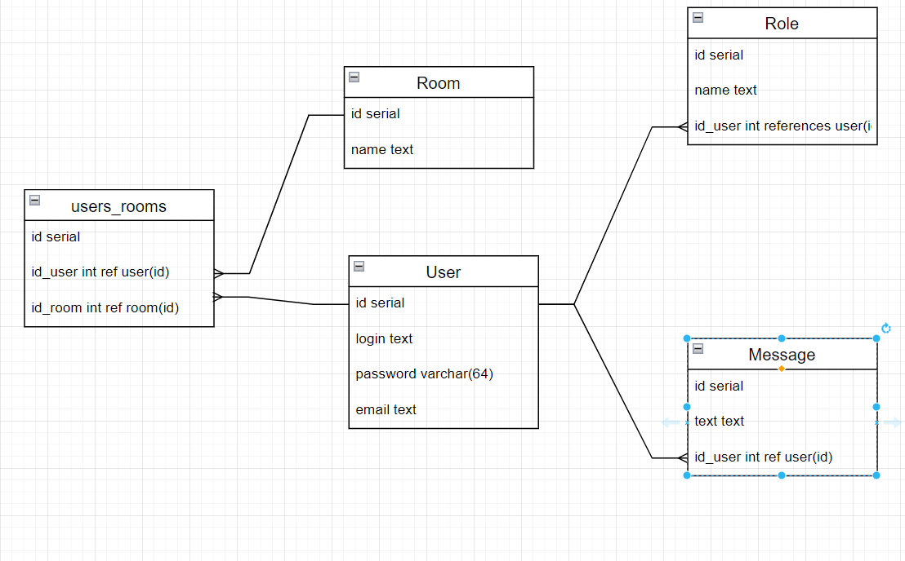

# Job4j_chat

Данное приложение иллюстрирует чат пользователей с комнатами, реализованный на REST API

В качестве инструментов будет использовано: Spring Boot, Spring Data, liquibase, 

Четыре модели: Person, Role, Room, Message.
В каждой комнате есть пользователи и список оставленных ими сообщений.

